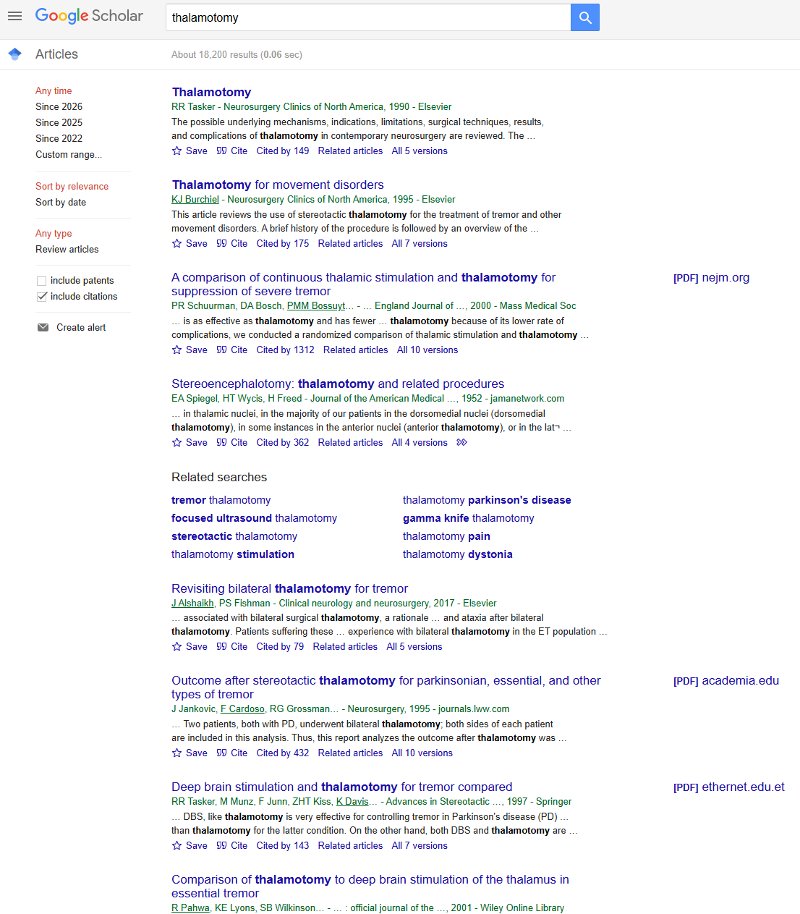
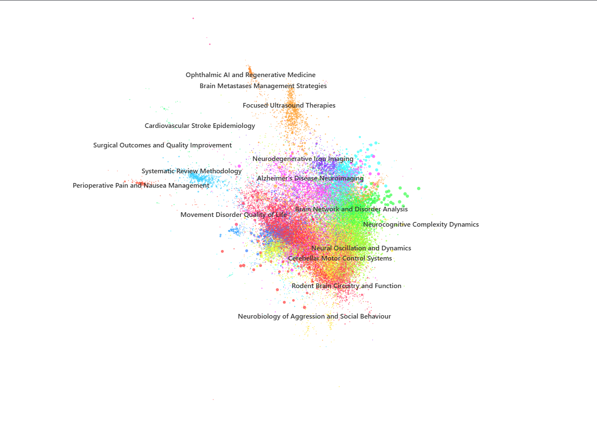
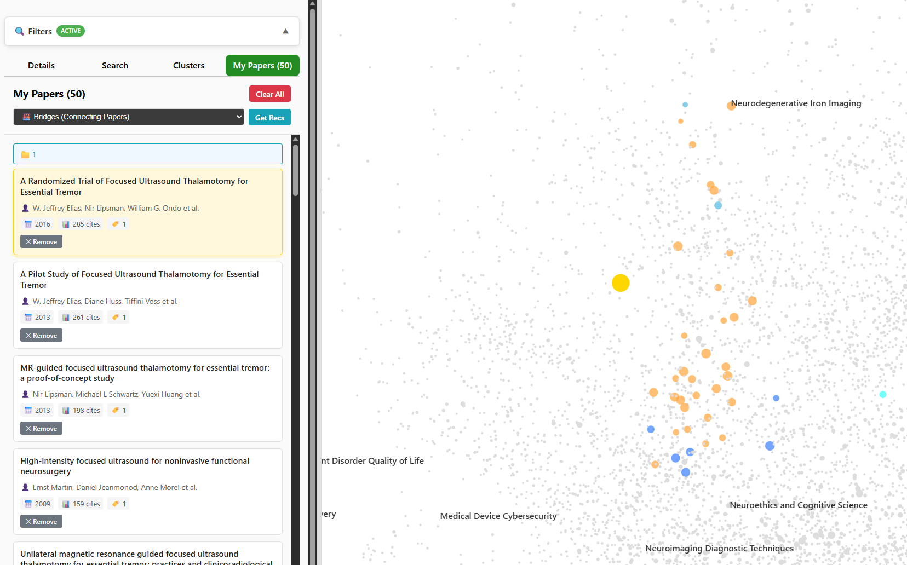

# Beyond the Blue Links: Building Citation Graph Infrastructure for AI-Assisted Research

## The Problem With Finding Papers

All scientific papers have references to existing literature, meaning there's a huge network which connects all the work. Almost every tool we have for searching literature ignores this network entirely and gives you a ranked list instead - I think that is a mistake worth taking seriously.

The scale of the problem makes it urgent. Scientific output grows at around 4 percent annually - a doubling time of roughly 17 years (Bornmann & Haunschild, 2021) - and by 2022, global output had reached 992,000 open access science and engineering articles (NSB, 2024). If you work in research, you feel this every time you open Google Scholar and stare at an endless list of blue links, sorted by some opaque relevance metric, with no indication of how any of these papers relate to each other.

The standard response is keyword search. The standard response to keyword search not being good enough is to do more of it, more carefully. Systematic reviews – arguably requiring the most comprehensive literature coverage - take on average 67 weeks to complete (Borah et al., 2017), often a full team working for over a year, just to be reasonably confident you have found everything relevant.

Meanwhile, the AI community has been building tools that promise to help. LLM-based systems like OpenScholar and PaperQA can retrieve and synthesise scientific literature with impressive fluency, but there is a telling statistic from the OpenScholar evaluation: when GPT-4o was asked to provide references for scientific claims, it hallucinated citations between 78 and 90 percent of the time (Asai et al., 2024) - the references looked plausible, they just did not correspond to real papers. No wonder there's a general sense of distrust from doctors about AI tools - If you work in a domain where you need to trust the evidence trail, this is basically disqualifying.

There's quite a big gap here. The human-facing tools - keyword search, Google Scholar, the various literature discovery platforms - give you real papers but no structural understanding of how they connect. The AI tools give you speed and synthesis but cannot reliably point to real sources. A growing ecosystem of tools like Connected Papers, Litmaps, and ResearchRabbit have started to exploit citation structure for visual exploration, but none of them exposes that structure as a queryable API that a software agent could navigate. What is needed is infrastructure that both humans and machines can work with: a structured, queryable map of the literature that a researcher can explore visually and an AI agent can query programmatically. That is what I have been building, and what this article is about.

## Literature Is a Network

The core insight - and it is not a new one - is that scientific papers are not independent documents. Every reference is a deliberate link, one author's judgement that another's work is relevant to what they are saying. To paraphrase a classic from neuroscience: papers that fire together, wire together. Within any research area, papers cite the same core works, reference each other, disagree with each other, and cluster into identifiable thematic communities. The literature is not a flat collection but a densely connected network, and every paper places itself into that network through the references it chooses.

This was recognised decades ago. Kessler (1963) introduced bibliographic coupling - the idea that two papers sharing references probably share intellectual context - and Small (1973) proposed co-citation analysis, taking the inverse approach where papers frequently cited together are linked regardless of whether they cite each other directly. Both methods were foundational for mapping the intellectual structure of research fields, and both were constrained by the same thing: the computing power available in the 1960s and 70s meant you had to discard a great deal of information to build a tractable network. Indirect proxies - shared references, co-occurrence patterns - were the best you could do at scale.

What has changed is not the theory but the feasibility. Direct citation networks, where you preserve every actual citation link between papers, retain information that those earlier methods had to throw away: the directionality of influence, the temporal sequence of knowledge building, the precise topology of how ideas propagate through a field. We can take inspiration from physics simulations here, nodes that are connected pull together, nodes that aren't push away. Force-directed layout algorithms like ForceAtlas2 (Jacomy et al., 2014), particularly when running with GPU-acceleration, can now position graphs of hundreds of thousands of nodes in two-dimensional space in minutes. The two-dimensional layout is primarily for human readability - in principle you could run this over a many-dimensional space for better separation, but that is a different project entirely.

The important point is that the resulting spatial structure is not just a visualisation - it is meaningful and queryable. Proximity in the graph encodes topic similarity, clusters correspond to thematic communities, and paths between nodes trace the flow of influence. These are things a human can see at a glance in a good layout, but they are also things a software agent could query through an API - the same graph that helps a researcher orient themselves in a new field could help an AI agent decide where to look next.

## I Built One

To test whether this actually works in practice, I built a citation graph on my home PC using a handful of APIs and a subject area I know well: thalamotomy. Specifically, MRI-guided focused ultrasound thalamotomy - a niche therapeutic procedure for essential tremor. I chose it partly because I had domain expertise from previous work, and partly because a niche seed should be a good stress test. The graph needs to handle both a tight core discipline and the interdisciplinary sprawl that happens when thalamotomy papers cite neurology papers, which cite neuroimaging papers, which cite physics papers, and so on.

Data collection was, by a considerable margin, the slowest part of the whole process. I used Crossref for paper metadata and forward references, and OpenAlex for backward citations - both open APIs, no institutional subscription needed, no Web of Science license, no Scopus export. A breadth-first search crawler starts from a handful of seed DOIs and expands the network by fetching both the references of each discovered paper and the papers that cite it. Four hops out from five seed papers, the graph expanded to approximately 700,000 papers spanning neuroscience, biomedical engineering, ultrasound physics, radiology, and multiple surgical specialties, which is exactly what you want - the system mapping out the broader intellectual neighbourhood that thalamotomy sits inside, not just the core literature.

Layout and clustering all ran locally on my graphics card (definitely the most sensible job this particular GPU has ever been called on for). ForceAtlas2 for spatial positioning, the Louvain algorithm (Blondel et al., 2008) for community detection with hierarchical sub-clustering: a first pass to identify broad thematic communities, then a second pass within each community to find finer-grained groupings. Two levels of granularity, which turns out to be enough for both quick orientation and more detailed exploration.

For cluster labelling, I self-hosted Llama 3.1 8B - mostly because I'm too tight to pay for API calls on a 700,000-paper graph. It turned out to have a genuine practical benefit though, in that no paper data leaves the system, which matters if you are working with pre-publication or commercially sensitive research. The model takes the titles and abstracts from representative papers in each cluster and produces a short thematic label. Sub-clusters are labelled first, then parent labels are generated by summarising the children weighted by size. The labels are not perfect (occasionally too generic or missing the distinguishing characteristic of a cluster) but they give you an immediate orientation to a field far too large to read.

I then built tools to actually use the graph - a web interface with a React frontend and FastAPI backend. I've worn many hats in my career already, but frontend engineer is not one of them, so while it all might look quite flashy it is being held together almost entirely with vibes, which is how it was built. The important part is the functionality underneath: searching to find individual papers, particularly within only a cluster or sub-cluster or using a collection of papers to find papers which are similar either spatial or by bridging papers. Everything is backed by a PostgreSQL database and exposed through a REST API, so the same endpoints that serve the web interface could equally serve an agent.

## Putting It to the Test

Building the graph was satisfying (and interesting testing the limits of Cursor!), but the question that actually matters is whether it helps you find papers. Happily, I had a good benchmark to hand. Former colleagues of mine had published a systematic review on the safety and efficacy of MRgFUS thalamotomy (Shiramba et al., 2025), and their final paper included 42 studies - the result of a thorough, manual literature search (finding over 1,000 papers) which had to be individually screened following standard systematic review methodology. I wanted to know how quickly and how completely I could reconstruct that list using the graph and the tools I had built on top of it.

In total I spent just 30 minutes, after which, I'd compiled a list of 50 papers that I judged to possibly be relevant to the same research question. I did this by identifying a cluster (Focus Ultrasound Therapies) that I thought was likely to be a good starting point and looking at some of the biggest nodes that were there (node size in the graph is relational to how much the work has been cited, so big node = influential paper) as well as searching for some papers that I already knew were likely to be included. Once I'd put together just 5 papers into a list, I made use of the bridging papers and spatial similarity to my list to very quickly gather the remaining set. The best thing about this is every time you add more papers homing in on a specific niche, the recommendations related to the list get updated, so it gets easier to find connecting, similar work, even though it's not as well-known potentially.

Of the 50 I found, 26 were among the 42 papers in the published systematic review, which gives a 62 percent recall rate. Of the 24 papers that I pulled that were 'wrong', 10 were meta-analyses, which are typically excluded but are still highly relevant to the research question.

Looking more closely at the graph structure and the real review, 40 of the 42 benchmark papers came from a single cluster. The graph had correctly identified the neighbourhood, and the remaining precision question was really about screening criteria rather than whether the right papers had been surfaced. The full cluster has a total of 30,341 papers, which would be a much narrower window to search compared with looking at all work ever published. Within the cluster, there's almost 100 subclusters of which many would clearly not be relevant. With proper set-up an agent could quickly pull a handful of sub-clusters entirely with high confidence that all relevant documents would be retrieved very quickly, giving more time for screening, either automatically or manually.

I am genuinely proud of 62 percent recall in 30 minutes, particularly given that the entire workflow could have been done via the API - which means it could be wrapped as a tool for an agent. If I had been smarter about using more of the tools I had built and went for a much higher recall specifically, I think performance could be better still - this was a more of a first pass on a prototype rather than a demonstration of a finely-tuned system.

Just to reframe the scale here - I have mapped a tiny corner of research around a procedure that I suspect the majority of people reading this have never heard of, with more papers than any individual could realistically consume in a lifetime. That probably says more about how insane a task it is to navigate the scientific literature without sensible tools than anything else in this article.

## What This Means

I think the core argument is fairly straightforward - treating scientific literature as a network rather than a flat collection has real, practical value. Citation structure lets us identify thematic communities quickly, label them automatically, and drill into them at increasing levels of granularity, clusters within clusters within clusters. A researcher can orient themselves in a field of 700,000 papers in minutes rather than months.

I should be honest about the limitations, though. Coverage currently depends on what Crossref and OpenAlex have indexed, and neither is complete - papers absent from these databases will be absent from the graph regardless of their relevance. The Louvain algorithm's resolution parameter meaningfully affects what clusters you get, and the right value is domain-dependent. The LLM-generated labels are usually informative but occasionally too generic. These are real constraints and I do not want to pretend they are solved problems.

That said, there's also some extra practical advantages worth emphasising too: the graph is incremental. New papers can be added continuously by re-crawling and re-running the layout algorithm - positions shift slightly to accommodate the new work rather than requiring a rebuild from scratch. It is a living map rather than a one-time snapshot, which matters a great deal if you want to keep up with an active field. You can choose to map only one small subsection (as I have done) and expand slowly, adding in new papers as they come out – there is a global map of all papers everywhere, but you don't need to start there, you can find just a corner of interest and build outwards.

The part I care about most is building these tools with AI in mind from the start. The graph is not just a visualisation, it is a queryable data structure. Every operation I performed manually in that 30-minute session could have been an API call - an agent could ask "what clusters/sub-clusters exist?", explore the most relevant ones, build a collection, request recommendations, and compile a candidate list, all programmatically. The infrastructure is the same whether the consumer is a human clicking through a web interface or a software agent making HTTP requests, and that dual-use design is I think the most important idea in this whole piece. You can trace precisely the working of the agent going through this by seeing it at the same time – meaning it feels more transparent and trust-worthy compared with GPT plucking references from thin air.

Looking forward, citation graphs are precisely the kind of relational structure that emerging graph-based retrieval-augmented generation architectures are designed to exploit - structured, queryable relationships that flat semantic similarity search cannot capture. Building agent systems that can navigate this infrastructure, reasoning about where to look rather than just what to retrieve and can show their working directly using a comfortable interface is the next step.

---

## References

- Asai, A., He, J., Shao, R., Shi, W., Singh, A., Chang, J. C., Lo, K., Soldaini, L., & others (2024). OpenScholar: Synthesizing scientific literature with retrieval-augmented LMs. *arXiv* preprint. arXiv: 2411.14199.
- Blondel, V. D., Guillaume, J.-L., Lambiotte, R., & Lefebvre, E. (2008). Fast unfolding of communities in large networks. *Journal of Statistical Mechanics: Theory and Experiment*, 2008(10), P10008. doi: 10.1088/1742-5468/2008/10/P10008.
- Borah, R., Brown, A. W., Capers, P. L., & Kaiser, K. A. (2017). Analysis of the time and workers needed to conduct systematic reviews of medical interventions using data from the PROSPERO registry. *BMJ Open*, 7(2), e012545. doi: 10.1136/bmjopen-2016-012545.
- Bornmann, L., & Haunschild, R. (2021). Growth rates of modern science: A latent piecewise growth curve approach to model publication numbers from established and new literature databases. *Humanities and Social Sciences Communications*, 8, 224. doi: 10.1057/s41599-021-00903-w.
- Jacomy, M., Venturini, T., Heymann, S., & Bastian, M. (2014). ForceAtlas2, a continuous graph layout algorithm for handy network visualization designed for the Gephi software. *PLoS ONE*, 9(6), e98679. doi: 10.1371/journal.pone.0098679.
- Kessler, M. M. (1963). Bibliographic coupling between scientific papers. *American Documentation*, 14(1), 10–25. doi: 10.1002/asi.5090140103.
- National Science Board (2024). *Science and Engineering Indicators 2024*. National Science Foundation.
- Shiramba, A., Lane, S., Ray, N., Gilbertson, T., Srinivasaiah, R., Panicker, J., Radon, M., Osman‐Farah, J. and Macerollo, A., 2025. Efficacy and safety of magnetic resonance‐guided focused ultrasound Thalamotomy in essential tremor: a systematic review and Metanalysis. *Movement Disorders*, 40(6), pp.1020-1033. doi: 10.1002/mds.30188
- Small, H. (1973). Co-citation in the scientific literature: A new measure of the relationship between two documents. *Journal of the American Society for Information Science*, 24(4), 265–269. doi: 10.1002/ASI.4630240406.

---

*Footnote:* It's amazingly meta that even this piece could be placed in a network because it references existing papers.
